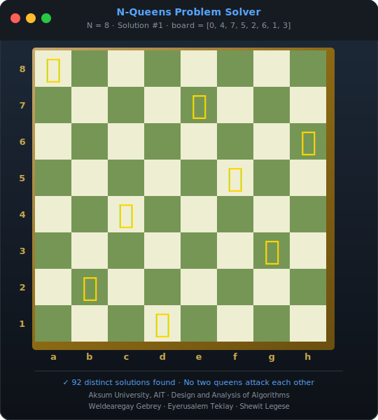
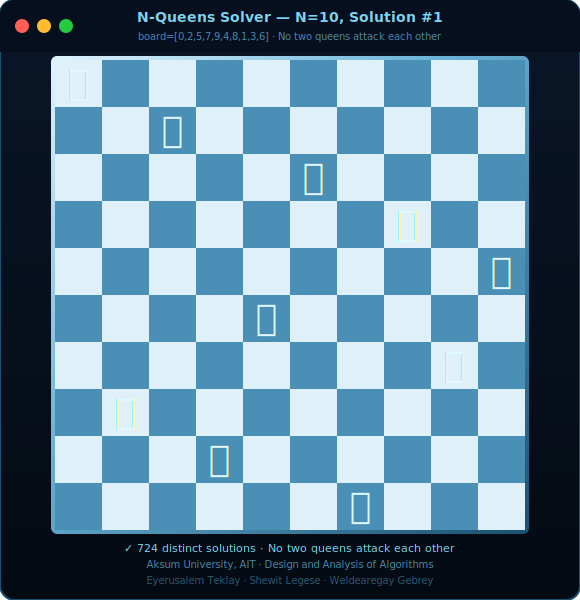
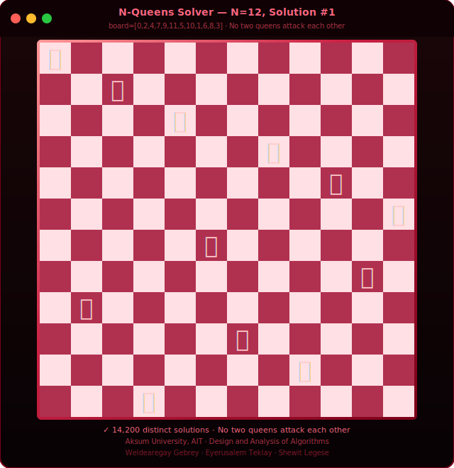
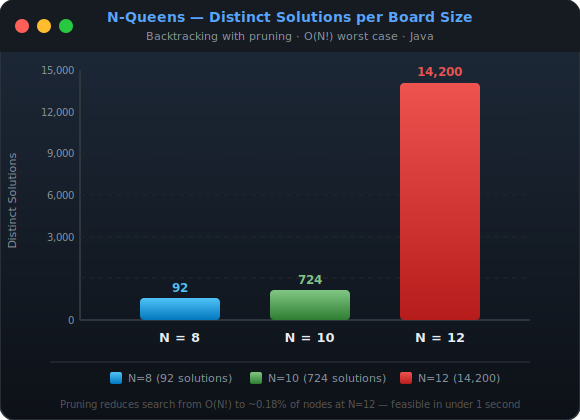

# N-Queens Problem Solver
### Backtracking with Pruning — Chess Board Arrangement

---

## Course Information

| Field | Detail |
|---|---|
| Course | Design and Analysis of Algorithms |
| University | Aksum University, AIT |
| Faculty | Faculty of Computing Technology |
| Department | Department of Computer Science |
| Language | Java |
| Algorithm | Backtracking with Bounding Function |

## Group Members

| No | Name | ID |
|----|------|----|
| 1 | Eyerusalem Teklay | Aku-1602682 |
| 2 | Shewit Legese | Aku-1602069 |
| 3 | Weldearegay Gebrey | Aku-1602148 |

---

## Problem Overview

Place N queens on an N×N chessboard such that no two queens attack each other.
Queens attack along rows, columns, and both diagonals.

This is a classic **constraint satisfaction problem** modelling real-world scenarios like antenna placement without interference and conflict-free scheduling.

---

## Features Implemented

-  Backtracking algorithm with pruning
-  1D array representation — `index = row`, `value = column` (row conflicts structurally impossible)
-  Bounding function `isSafe()` — checks column and diagonal conflicts
-  Solves for N = 8, 10, 12
-  Counts all distinct solutions
-  Displays first 3 solutions as visual Q/. grid with row/column labels
-  Raw 1D array printed under each solution board
-  Pruned branch count + pruning % per board size
-  Execution time (ms) and recursive call count per board size
-  Summary table — N, solutions, time, recursive calls, pruned branches
-  Complexity analysis — N! worst case vs actual calls with % reduction
-  Real-world applications section in output

---

## How to Compile and Run

```bash
# Compile
javac src/nqueens/NQueensSolver.java -d out

# Run
java -cp out nqueens.NQueensSolver
```

---

## Known Solution Counts

| N | Distinct Solutions | Pruning Reduction |
|---|---|---|
| 8 | 92 | ~94.9% |
| 10 | 724 | ~99.0% |
| 12 | 14,200 | ~99.8% |

---

## Complexity Analysis

| Operation | Complexity |
|---|---|
| Worst case (no pruning) | O(N!) |
| With backtracking pruning | Much less than O(N!) |
| `isSafe()` per call | O(N) |
| Space complexity | O(N) — 1D board array + call stack |

---

## Real-World Applications

- Antenna placement without signal interference
- Conflict-free task scheduling
- CPU register allocation
- Resource placement optimisation
- Constraint satisfaction problems

---

## Screenshots

**Board Visualization — N=8, Solution #1**



**Board Visualization — N=10, Solution #1**



**Board Visualization — N=12, Solution #1**



**Solution Count Chart**



---

> See `docs/` for full requirements, design document, and implementation plan.

---

## 📄 Report

[View Full Report](https://htmlpreview.github.io/?https://github.com/shewitalpha01-star/N-QUEENS-PROBLEM/blob/main/docs/report.html)
