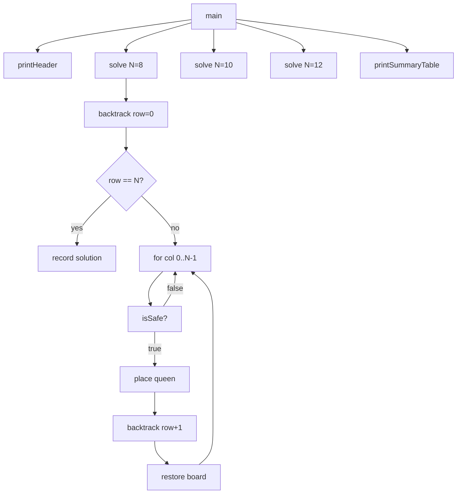

# Design Document: N-Queens Solver

## Overview

The N-Queens Solver is a Java console application that finds all distinct solutions to the N-Queens
problem using a backtracking algorithm with constraint-based pruning. The program runs for N = 8,
10, and 12 in a single execution, displaying a subset of solutions in a human-readable board format
along with execution time and recursive call counts to support complexity analysis.

The core algorithmic technique is **backtracking with bounding**: queens are placed row by row, and
a bounding function checks column and diagonal conflicts before each placement. Any branch that
violates a constraint is pruned immediately, reducing the effective search space from O(N^N) toward
O(N!) with significant constant-factor improvement from pruning.

This project is developed for the Design and Analysis of Algorithms course at Aksum University, AIT,
Faculty of Computing Technology, Department of Computer Science.

---

## Architecture

The program is a single-class Java application with clearly separated responsibilities:

```
NQueensSolver (main class)
├── main()                  – Entry point; runs solver for N = 8, 10, 12; prints summary table
├── solve(n)                – Initialises board and counters; calls backtrack(); returns SolveResult
├── backtrack(board, row)   – Recursive backtracking engine; records solutions and call count
├── isSafe(board, row)      – Bounding function; checks column and diagonal conflicts
├── printBoard(board)       – Renders a solution as an N×N grid with 'Q' and '.'
└── printHeader()           – Prints program identification header
```



---

## Components and Interfaces

### `NQueensSolver` (main class)

The entire solver lives in one class to keep the submission self-contained, matching the style of
the group's previous Q4 Emergency Room Triage project.

#### `solve(int n) : SolveResult`

Initialises a fresh `int[]` board of size `n`, resets the solution list and call counter, records
the start timestamp, invokes `backtrack`, records the end timestamp, and returns a `SolveResult`.

#### `backtrack(int[] board, int row, SolveResult result)`

Recursive method. Base case: `row == n` → copy board into `result.solutions`, increment
`result.solutionCount`. Recursive case: iterate columns 0 to n-1, call `isSafe`, place queen,
recurse, restore (backtrack).

#### `isSafe(int[] board, int row) : boolean`

Iterates rows 0 to `row - 1`. Returns `false` immediately on column conflict
(`board[i] == board[row]`) or diagonal conflict (`Math.abs(board[i] - board[row]) == Math.abs(i - row)`).
Returns `true` if no conflict found.

#### `printBoard(int[] board, int n)`

Prints an N×N grid. For each row, prints `Q` at the queen's column and `.` elsewhere.

#### `printHeader()`

Prints the program identification block (name, course, university, department).

#### `printSummaryTable(SolveResult[] results)`

Prints a formatted table with columns: N | Solutions | Time (ms) | Recursive Calls.

---

### `SolveResult` (inner class or record)

Holds all output data for one board size:

| Field            | Type              | Description                                  |
|------------------|-------------------|----------------------------------------------|
| `n`              | `int`             | Board dimension                              |
| `solutionCount`  | `int`             | Total distinct solutions found               |
| `solutions`      | `List<int[]>`     | All solution boards (for display subset)     |
| `elapsedMs`      | `long`            | Execution time in milliseconds               |
| `recursiveCalls` | `long`            | Total recursive calls made during search     |

---

## Data Models

### Board Representation

The board is a `int[]` of length N. Index `i` is the row; `board[i]` is the column of the queen in
that row. This 1D representation structurally eliminates row conflicts — no two queens can share a
row because each row has exactly one slot.

```
board = [col_0, col_1, col_2, ..., col_{N-1}]
         row 0  row 1  row 2        row N-1
```

Example: `board = [0, 4, 7, 5, 2, 6, 1, 3]` is one valid 8-Queens solution.

### Conflict Detection Logic

For a queen at row `r` and column `board[r]`, a conflict with a previously placed queen at row `i`
exists if:

- **Column conflict**: `board[i] == board[r]`
- **Diagonal conflict**: `|board[i] - board[r]| == |i - r|`

Row conflicts are impossible by the 1D array design.

### Known Solution Counts

| N  | Distinct Solutions |
|----|--------------------|
| 8  | 92                 |
| 10 | 724                |
| 12 | 14,200             |

These serve as ground-truth values for verifying solver correctness.

---

## Correctness Properties

*A property is a characteristic or behavior that should hold true across all valid executions of a
system — essentially, a formal statement about what the system should do. Properties serve as the
bridge between human-readable specifications and machine-verifiable correctness guarantees.*


### Property 1: isSafe rejects all conflicting placements

*For any* board array and row index `r`, if any previously placed queen in rows 0 to r-1 shares the
same column (`board[i] == board[r]`) or the same diagonal (`|board[i] - board[r]| == |i - r|`) as
the queen at row `r`, then `isSafe(board, r)` SHALL return `false`.

**Validates: Requirements 2.2, 2.3**

---

### Property 2: isSafe accepts all conflict-free placements

*For any* board array and row index `r` where no previously placed queen in rows 0 to r-1 shares a
column or diagonal with the queen at row `r`, `isSafe(board, r)` SHALL return `true`.

**Validates: Requirements 2.5**

---

### Property 3: Every recorded solution is non-attacking

*For any* N and *for any* solution board returned by the solver, every pair of queens (i, j) where
i ≠ j SHALL satisfy: `board[i] != board[j]` (no column conflict) AND
`|board[i] - board[j]| != |i - j|` (no diagonal conflict).

**Validates: Requirements 3.6**

---

### Property 4: Solution count matches known ground truth

*For each* of N = 8, N = 10, and N = 12, the solver SHALL return exactly the known number of
distinct solutions: 92 for N = 8, 724 for N = 10, and 14,200 for N = 12.

**Validates: Requirements 4.2, 5.1**

---

### Property 5: Board rendering contains exactly N queens

*For any* valid solution board of size N, the string produced by `printBoard` SHALL contain exactly
N occurrences of the character `'Q'` and exactly N × (N − 1) occurrences of the character `'.'`.

**Validates: Requirements 5.3**

---

### Property 6: Recursive call count is positive for any valid N

*For any* N ≥ 1, the `recursiveCalls` counter in the returned `SolveResult` SHALL be greater than
zero, confirming that the backtracking search was actually executed.

**Validates: Requirements 6.4**

---

## Error Handling

| Scenario | Handling |
|---|---|
| N ≤ 0 | Print an error message and skip that board size; do not crash. |
| N = 1 | Valid: one solution (`board = [0]`). Handled naturally by the algorithm. |
| N = 2 or N = 3 | Valid: zero solutions. Solver completes normally and reports 0 solutions. |
| N > 12 (large N) | Solver runs; if it takes too long the user can interrupt. No hard timeout is imposed — the assignment only requires N = 8, 10, 12. |
| Out-of-memory for very large N | JVM will throw `OutOfMemoryError`; this is acceptable for values far beyond the required range. |

---

## Testing Strategy

### Approach

The solver contains pure algorithmic logic (no I/O dependencies in the core functions), making it
well-suited for both example-based unit tests and property-based tests.

**Property-based testing library**: [jqwik](https://jqwik.net/) — a mature PBT library for Java
that integrates with JUnit 5. Each property test runs a minimum of **100 iterations**.

### Unit Tests (Example-Based)

Focus on specific, concrete scenarios:

- `isSafe` returns `false` for a known column conflict (e.g., `board = [0, 0]`, row 1).
- `isSafe` returns `false` for a known diagonal conflict (e.g., `board = [0, 1]`, row 1).
- `isSafe` returns `true` for the first queen placed (row 0, any column).
- `solve(1)` returns exactly 1 solution: `[0]`.
- `solve(2)` returns 0 solutions.
- `solve(3)` returns 0 solutions.
- `solve(8)` returns 92 solutions (ground truth).
- `printBoard` output for a known 4-Queens solution matches expected string.
- `SolveResult.elapsedMs` is non-negative after `solve(8)`.
- Summary table output contains "92" for N = 8.

### Property-Based Tests

Each test references its design property via a comment tag:
`// Feature: n-queens-solver, Property <N>: <property_text>`

| Property | Test Description | Generator |
|---|---|---|
| Property 1 | For any board with an injected column conflict, `isSafe` returns `false` | Generate random partial boards; inject a column conflict at a random row |
| Property 2 | For any known valid partial board, `isSafe` returns `true` | Generate valid partial solutions by running the solver and sampling intermediate states |
| Property 3 | For any solution returned by `solve(n)`, all queen pairs are non-attacking | Run `solve` for N ∈ {4, 5, 6, 7, 8}; check every solution |
| Property 4 | `solve(n)` returns the known solution count for N ∈ {8, 10, 12} | Fixed inputs; verify count matches ground truth |
| Property 5 | `printBoard` output contains exactly N `'Q'` and N×(N−1) `'.'` | Generate valid solutions for N ∈ {4..10}; render and count characters |
| Property 6 | `solve(n).recursiveCalls > 0` for any N ≥ 1 | Generate N ∈ {1..10}; verify counter |

### Test Configuration

```java
// jqwik configuration in src/test/resources/jqwik.properties
database.mode=RESTARTABLE
tries.default=100
```

### Integration / Smoke Tests

- Run `main()` and capture stdout; verify header is printed, divider lines appear, and summary table
  contains the three known solution counts (92, 724, 14200).
- Verify output order: N = 8 block appears before N = 10, which appears before N = 12.
